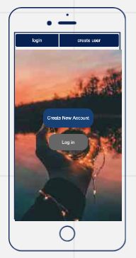
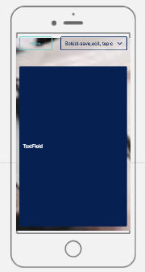
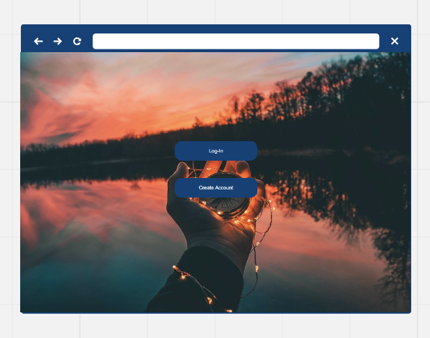
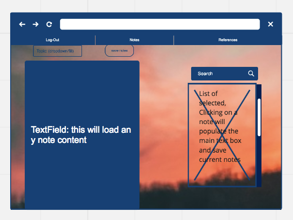
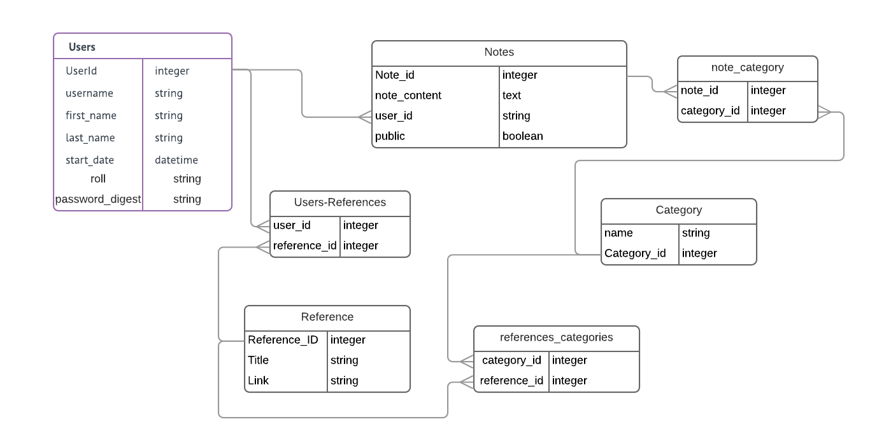

# Concept:

Flatiron Students Connect is a program designed as place that students can share notes and resources while going through the Flatiron course. While Slack is a useful tool we would often lose resources from the begining of the program 

## As a Student I want to:
  * Take notes
  * Filter my notes by topic
  * Search my notes and public notes for relivant key words 
  * Share my notes with other students
  * Keep a list of Resources that I use regularly 
  * Share those resources with other students
  * See and use resources that other students have found useful

# Wireframes:

## Mobile:
 

## Full Screen:

# Frame Works and Libraries

### Frontend:

* React
* Redux
* Thunk
* Quill (Rich Text for React)
* Semantic-Ui-React
* React-Router

### Backend:

* Rails
* Postgres
* Jwt (Token Auth)
* Figaro (ENV key manager) 

# Rails Backend 

<a href="https://github.com/wley3337/modfivebackend">Rails Backend Repo</a>

## Model Design:

